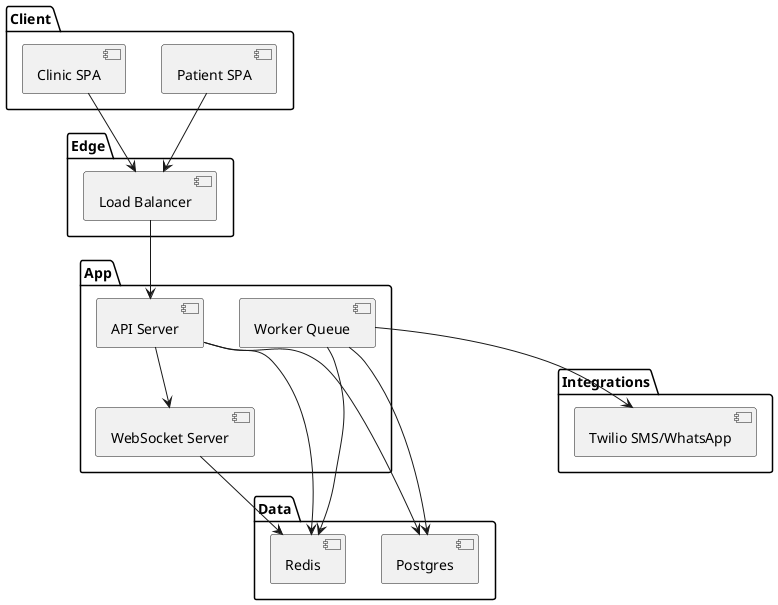
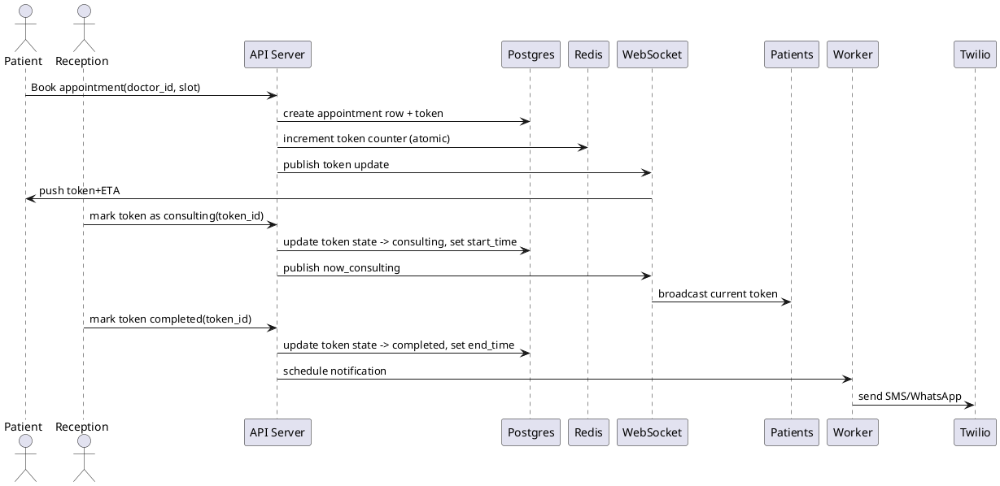

# SPEC-1-Appointment Booking Webapp - Kerala

## Background

Hospitals and local home clinics in Kerala face long patient waiting times and fragmented appointment systems. A centralized web application that allows clinics (both single-doctor clinics and multi-department hospitals) to register, publish consulting hours, and accept patient appointments will reduce waiting time, improve patient flow, and simplify front-desk operations. The initial deployment target is a centralized hosted platform for all clinics in Kerala; a self-host option may be considered in a later phase.

## Requirements

### MUST (Essential)

* Centralized multi-tenant platform where hospitals/clinics can register.
* **City-based browsing**: Patients first choose a city → list clinics/doctors → filter by specialty.
* **Patient mobile number + OTP verification** required before booking.
* Patient-facing appointment booking UI (web + responsive) with time-slot selection.
* Token generation on booking with approximate waiting time estimate.
* Doctor/clinic admin portal to add doctors, consulting schedules, consultation durations, and manage tokens.
* Token lifecycle states: **Waiting → Consulting → Completed → Cancelled → Late → Skipped**.
* Clinic staff must be able to manually: **create emergency tokens**, **create walk‑in tokens**, **create phone-call booking tokens**, and **handle late arrivals**.
* Real-time token status updates visible to patients.
* English-only UI for MVP.
* Authentication & RBAC for clinic staff; OTP login for patients (no password).
* SMS & WhatsApp notifications (booking, reminders, token status).
* Audit logging for token overrides & manual actions.
* Basic analytics.

### SHOULD (High priority)

* Wait-time prediction algorithm using historical consultation durations and current queue.
* SMS/WhatsApp integration for reminders and live token alerts.
* Public clinic search by location, specialty, doctor, and available slots.
* Rate-limiting / anti-spam for appointment creation.
* Exportable reports (CSV/PDF) for clinics.

### COULD (Optional / Nice-to-have)

* Mobile apps (iOS/Android) or PWA with push notifications.
* Support for multiple consultation types (in-person, teleconsultation, home visit).
* Payment integration for paid appointments or refundable token booking fees.
* Role-specific dashboards (doctor daily list, reception queue board, admin overview).
* Integration with hospital HIS/EHR via APIs (future).

### WON'T (Out of scope for MVP)

* Full hospital EHR replacement.
* Self-hosted deployments per clinic in phase 1.
* Complex insurance/payment reconciliation in MVP.

---

## Assumptions

* Centralized SaaS model for Kerala initially.
* Most clinics prefer automatic token sequencing with occasional manual overrides.
* SMS gateways and WhatsApp Business API availability will be arranged per clinic's budget.

---

## Method

### High-level architecture

* **SaaS multi-tenant backend (API)** — central server exposes REST + WebSocket endpoints. Each request carries `tenant_id` (clinic) to enforce isolation. Use schema-level or row-level tenant isolation in Postgres (row-level with `tenant_id` column) for MVP.
* **Frontend** — Single Page App (React) for patients and clinic staff. Progressive Web App (PWA) ready for future mobile push.
* **Realtime layer** — WebSockets (Socket.IO or native WS) backed by Redis Pub/Sub for scaling across app servers.
* **Data stores** — PostgreSQL for transactional data, Redis for short-lived state, caching, and locking (token assignment), and an append-only log (WAL-based off or simple audit table) for audit.
* **Integration services** — SMS & WhatsApp via Twilio (or local providers) for notifications. Optional SMTP for email.
* **Auth & RBAC** — JWT access tokens, refresh tokens, role-based checks on API.
* **Monitoring & Analytics** — Prometheus + Grafana for infra metrics; simple analytics jobs to compute average wait times and no-show rates.

### Component PlantUML



### Token assignment & lifecycle (algorithm)

**Constraints & rules**

* Tokens scoped per `(tenant_id, doctor_id, date)` sequence.
* Default: automatic increment `next_token = max(token) + 1` per doctor per day.
* Allow manual override: reception/admin may `skip`, `call`, or `insert` emergency tokens.
* Token states: `created (booked) -> waiting -> consulting -> completed | cancelled`.

**Atomic token assignment**

* Use Redis distributed lock or Postgres `SELECT ... FOR UPDATE` on a `counters` table to guarantee unique sequential tokens under concurrency.

**Approximate wait-time estimation (MVP)**

1. Keep `avg_duration_last_30` per `(doctor_id)` computed by background job: moving average of last 30 completed consults.
2. When a patient books, compute `waiting_count = number of waiting tokens ahead for that doctor`.
3. Estimated wait = `avg_duration_last_30 * waiting_count`.
4. While doctor is consulting, update estimate dynamically: `remaining_current = max( avg_duration_last_30 - elapsed_since_current_started, 0)`, then recalc.

**Improvement (phase 2)**: use linear regression or exponentially-weighted moving average per doctor + time-of-day adjustments.

### Token lifecycle sequence (PlantUML sequence)



### Database schema (concise MVP)

```sql
-- tenants (clinics)
CREATE TABLE tenants (
  id uuid PRIMARY KEY,
  name text NOT NULL,
  city text NOT NULL,
  address text,
  phone text,
  created_at timestamptz DEFAULT now()
);

-- users (clinic staff only)
CREATE TABLE users (
  id uuid PRIMARY KEY,
  tenant_id uuid REFERENCES tenants(id),
  role text NOT NULL, -- admin, doctor, receptionist
  name text NOT NULL,
  email text,
  phone text,
  password_hash text,
  created_at timestamptz DEFAULT now()
);

-- patients (OTP-based login, no password)
CREATE TABLE patients (
  id uuid PRIMARY KEY,
  tenant_id uuid REFERENCES tenants(id),
  name text NOT NULL,
  phone text NOT NULL,
  phone_verified boolean DEFAULT false,
  last_otp_code text,
  last_otp_sent_at timestamptz,
  age int,
  gender text,
  meta jsonb,
  created_at timestamptz DEFAULT now()
);

-- doctors (profile)
CREATE TABLE doctors (
  id uuid PRIMARY KEY,
  tenant_id uuid REFERENCES tenants(id),
  user_id uuid REFERENCES users(id),
  specialty text,
  consult_duration_minutes int DEFAULT 10,
  created_at timestamptz DEFAULT now()
);

-- schedules (weekly rules or specific dates)
CREATE TABLE schedules (
  id uuid PRIMARY KEY,
  doctor_id uuid REFERENCES doctors(id),
  start_time time,
  end_time time,
  day_of_week int, -- 0=Sunday..6=Saturday
  is_active boolean DEFAULT true
);

-- appointments / tokens
CREATE TABLE appointments (
  id uuid PRIMARY KEY,
  tenant_id uuid REFERENCES tenants(id),
  doctor_id uuid REFERENCES doctors(id),
  patient_id uuid REFERENCES users(id),
  token_number int,
  state text, -- created,waiting,consulting,completed,cancelled
  scheduled_start timestamptz,
  created_at timestamptz DEFAULT now(),
  started_at timestamptz,
  ended_at timestamptz,
  duration_seconds int,
  meta jsonb
);

-- counters table for safe token increment (alternative Redis)
CREATE TABLE counters (
  id uuid PRIMARY KEY,
  tenant_id uuid,
  doctor_id uuid,
  date date,
  last_token int DEFAULT 0,
  UNIQUE(tenant_id,doctor_id,date)
);

-- audit log
CREATE TABLE audit_logs (
  id uuid PRIMARY KEY,
  actor_id uuid,
  tenant_id uuid,
  action text,
  payload jsonb,
  created_at timestamptz DEFAULT now()
);
```

### Concurrency & scaling

* Use Redis for distributed locks when many parallel bookings occur. For strong consistency use Postgres row-lock on `counters` table inside transactions.
* WebSocket servers scale behind the load balancer; use Redis Pub/Sub to broadcast state changes across instances.
* Worker queue (BullMQ / RabbitMQ) for background jobs: SMS/WhatsApp, analytics aggregation, report generation.

### Security & compliance

* Encrypt PII at rest where possible (database column-level encryption for phone numbers optional), TLS in transit.
* GDPR-like principles: data retention policies, ability to delete patient data per request.
* Rate-limit endpoints to avoid abuse.

---

## Implementation

### Tech stack (MVP)

* **Backend**: FastAPI (async), Python 3.11+
* **ORM / DB access**: SQLModel or SQLAlchemy 2.0 (async) + asyncpg
* **Migrations**: Alembic
* **Database**: PostgreSQL (managed like RDS / Cloud SQL)
* **Realtime**: FastAPI WebSockets + Redis Pub/Sub (aioredis)
* **Cache / locking / broker**: Redis (locks, counters)
* **Background workers**: Celery (with Redis broker) or RQ as lighter alternative
* **Notifications**: Twilio (SMS & WhatsApp) — fallback to local SMS gateways if needed
* **Containerization**: Docker, Docker Compose for dev; Kubernetes for production optional
* **Authentication**: JWT (PyJWT / jose) for clinic staff; OTP via SMS for patient-confirmation (optional)
* **Logging & Monitoring**: Prometheus exporters, Grafana, ELK or managed logging (CloudWatch / Stackdriver)
* **Testing**: pytest, httpx for async HTTP tests

### Folder structure (suggested)

```
app/
├─ api/
│  ├─ v1/
│  │  ├─ patients.py
│  │  ├─ clinics.py
│  │  ├─ doctors.py
│  │  ├─ appointments.py
│  │  └─ tokens.py
├─ core/
│  ├─ config.py
│  ├─ security.py
│  └─ events.py
├─ db/
│  ├─ models.py
│  ├─ crud.py
│  └─ migrations/
├─ workers/
│  ├─ tasks.py
│  └─ celery_app.py
├─ services/
│  ├─ twilio_client.py
│  ├─ notifications.py
│  └─ wait_estimator.py
├─ websockets/
│  └─ manager.py
├─ main.py
├─ tests/
└─ Dockerfile
```
